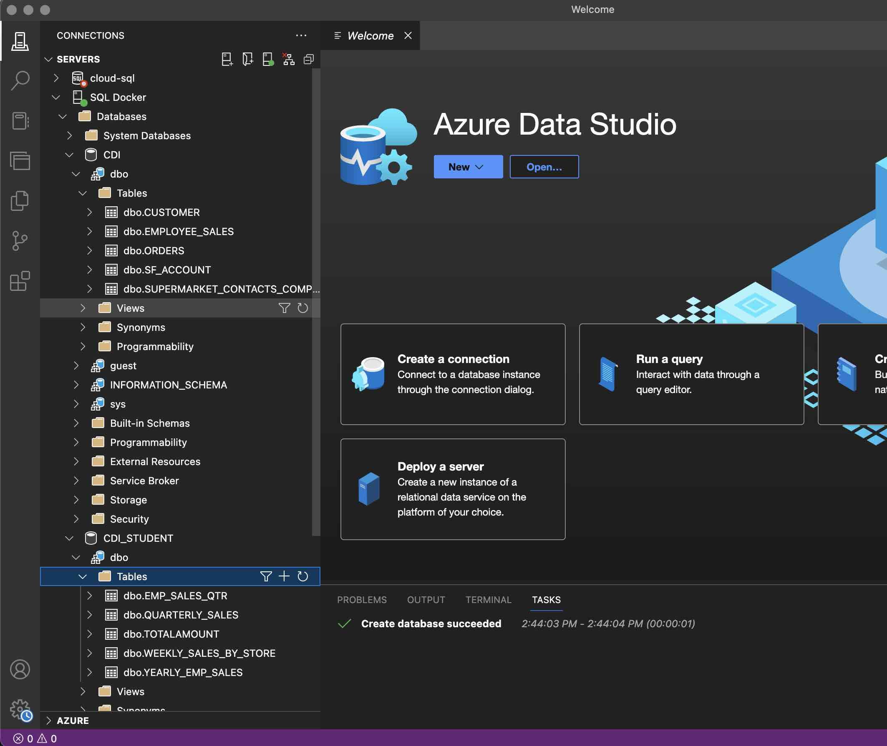

# Unofficial IICS Secure Agent Container

Build an IICS docker container based on the latest `agent64_install` for linux.

## Requirements

- Docker or [Docker Desktop](https://www.docker.com/products/docker-desktop/)
- A Bash Shell
- The Informatica `agent64*.bin` for Linux
- Git (or a download of this repo)

## Usage

> These steps assume this repo has been cloned or copied locally.  Make sure to open a bash shell to the local folder to complete the steps.

1. Download the IICS Secure Agent for Linux and place it in the root directory of this local repo/folder where you find the `build.sh` script. 

> This will generally be a file like `agent64_install_ng_ext6713.bin`

2. Build the docker container with `bash build.sh`.  The default is to build a docker image tagged `local/iics-secure-agent`.

__build.sh__
```
docker build -t local/iics-secure-agent . --no-cache
```

3. Copy the `.env.sample` file to `.env` and add the correct values for your environment.

```
IICS_RUNTIME_NAME=<the name of the runtime group>
IICS_TENANT_NAME=<your IICS user email account>
IICS_TOKEN=<the secure agent token>
```

4. Launch the docker secure agent with `bash run.sh`.  This will use the values from the `.env` file to configure the agent.

__run.sh__
```
docker run --name iics-secure-agent \
  --env-file .env \
  -h iics-docker-agent \
  -v ./flatfiles:/flatfiles \
  -d local/iics-secure-agent:latest
```

5. Monitor the agent in the docker logs.

To access local files you can mount volumes into the docker container.  The `flatfiles` folder is automatically mounted to the host.

> Note that to access the host from the docker secure agent you will need to use `host.docker.internal` in place of `localhost`.

## On Windows

- Requires Git and Git Bash installed, as well as Docker Desktop

- Before cloning the repository on Windows ensure git autoCRLF is turned off `git config --global core.autocrlf false`.  

- Use Git Bash to run the `build.sh` and `run.sh` scripts.

## Docker Compose

A sample `docker-compose` file is provided.  It uses the same [.env](.env.sample) file environment variable settings.  

The stack includes MS SQL Server and MySQL along with this IICS secure agent container.

`bash compose.sh` will launch the `iics-secure-docker-agent` stack.

or

`docker-compose -p "iics_agent_stack" up -d`

> The compose stack is good for completing Informatica training sessions

### IICS Stack Usage

Once the `docker-compose` stack is up, it will show in docker desktop:


[Azure Data Studio](https://azure.microsoft.com/en-ca/products/data-studio) is a good way to interact with the [SQL Server Docker Container](https://hub.docker.com/_/microsoft-mssql-server).  Informatica sample `.txt` and `.csv` files can be loaded much like with the Windows SQL Server Studio.

> Data Studio is built on the VS Code platform.


It is possible to perform a complete Informatica Lab setup using this stack:



Data Studio can be used to connect to, and query, a wide variety of databases, especially those running in containers.


__Note:__ when connecting from the secure agent to database containers in the stack, use the names referenced in the stack as hostnames for connection.  Eg. `sql-server:1433` and `mysql:3306`.

## Additional Screenshots

With a Windows VM on macOS running MS SQL Server, the docker `iics-secure-agent` is launched on macOS.


In the IICS Runtime console the agent is running:


And a connection can be made to the MSSQL running on the Windows VM:


The container can also be built and run on Windows via Docker:


