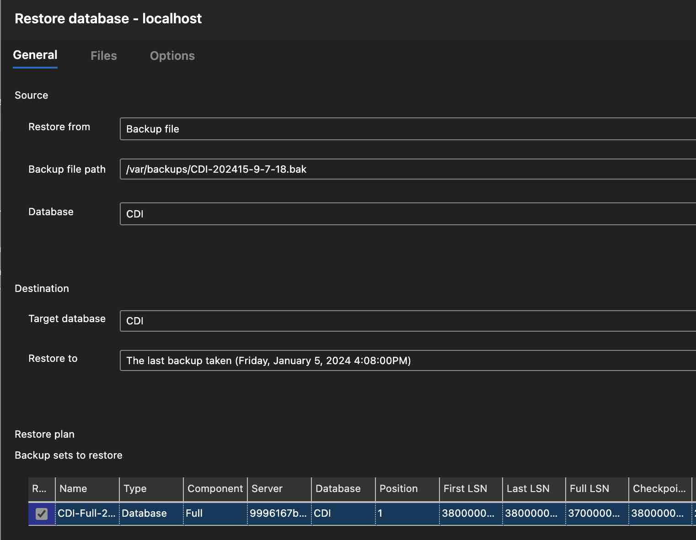
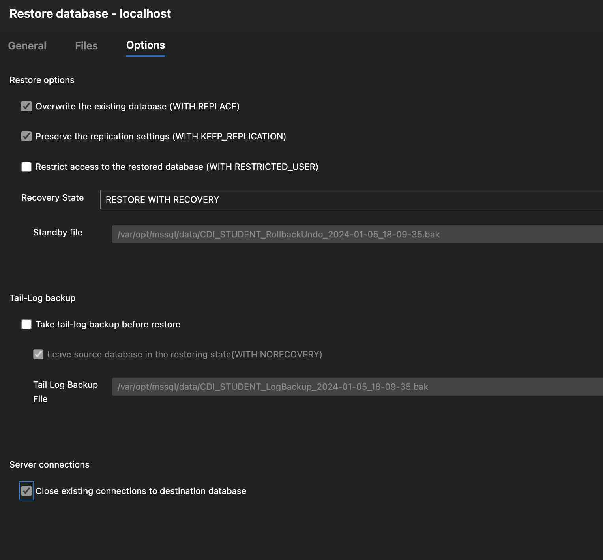

# SQL Server CDI Backup Restore

The `CDI` and `CDI_STUDENT` databases can be restored to the `sql-server` docker instance running in docker-compose using [Azure Data Studio](https://azure.microsoft.com/en-ca/products/data-studio).  With the `*.bak` files all of the required tables and data can be loaded easily in two operations.

> This is great for `macOS` users who do not want to run Windows or VMs.

1. Using Azure Data Studio, connect to the SQL Server that is now available on `localhost:1433` once the `iics-agent-stack` is running.

> Use the `sa` account and password supplied in the `.env` file.

2. Once connected, right-click on the database (Eg. CDI) and select `Restore`.

3. Place your `CDI*.bak` and `CDI_STUDENT*.bak` files in the `backups` folder.  This will be available to your `sql-server` container instance as `/var/backups`

4.  From the `Restore` dialog, select the correct `*.bak` file in `/var/backups`, as shown below:

5. __Important__, make sure to __select and de-select__ the following options from the options tab to avoid errors in the restore process:

The databases should be restored with the correct tables and data for the CDI labs.

